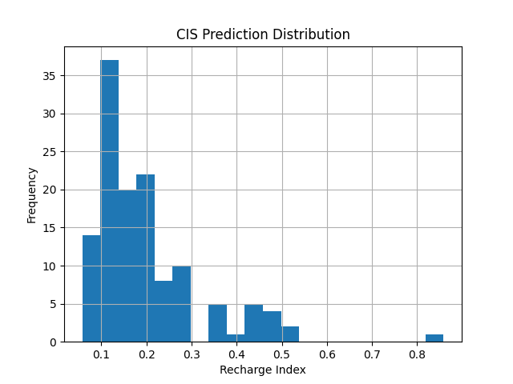

🌊 PSA-Based Aquifer Recharge Potential Mapping

Hybrid Particle Swarm Optimization (PSO) + Clonal Selection Algorithm (CSA)

📌 Project Title

AI-Driven Aquifer Recharge Potential Mapping Using Hybrid PSO-CSA Optimization

🧠 Problem Statement

Groundwater depletion is a critical environmental challenge caused by irregular rainfall distribution, rapid urbanization, and unplanned land use. Identifying high-potential aquifer recharge zones is essential for sustainable water resource management.

Traditional hydrogeological methods are:

Time-consuming

Cost-intensive

Limited in spatial scalability

This project proposes a Hybrid PSO + CSA optimization framework integrated with Machine Learning to accurately predict aquifer recharge potential using rainfall-derived features.

🎯 Objectives

Predict Aquifer Recharge Potential Index

Optimize ML model hyperparameters using PSO + CSA

Generate visual insights and analytical outputs

Save deployment-ready artifacts

Provide a scalable framework for future GIS & CNN integration

🧬 Hybrid Model Architecture (PSA)
Rainfall Data
     ↓
Feature Engineering
     ↓
Standardization
     ↓
PSO (Global Search)
     ↓
CSA (Local Refinement)
     ↓
Optimized Random Forest Model
     ↓
Recharge Potential Prediction

🧪 Algorithms Used
🔹 Particle Swarm Optimization (PSO)

Performs global hyperparameter exploration

Identifies promising regions in the search space

Prevents premature convergence

🔹 Clonal Selection Algorithm (CSA)

Refines PSO solutions via cloning & mutation

Enhances exploitation of optimal regions

Improves stability and accuracy

🔹 Random Forest Regressor

Handles non-linearity

Robust against overfitting

Works well with limited hydrological features

📊 Dataset Used
Primary Dataset

District Wise Rainfall Normal (India)
Source: Government rainfall statistics (CSV)

Features Extracted

Mean Rainfall

Standard Deviation of Rainfall

Target Variable

Recharge Index
(Normalized rainfall proxy for aquifer recharge)

🗂️ Project Structure
Aquifer Recharge Potential Mapping/
│
├── archive/
│   └── district wise rainfall normal.csv
│
├── psa_accuracy.png
├── psa_prediction_vs_actual.png
├── psa_heatmap.png
├── psa_prediction_distribution.png
│
├── psa_recharge_results.csv
├── psa_recharge_predictions.json
├── psa_recharge_model.pkl
├── psa_recharge_scaler.pkl
│
├── psa_hybrid_model.py
└── README.md

📈 Outputs Generated
📊 Visual Outputs

Model Accuracy Graph (Train vs Test R²)

Prediction vs Actual Scatter Plot

Feature Correlation Heatmap

Prediction Distribution Histogram

📁 Saved Files
File	Description
psa_recharge_results.csv	District-wise recharge predictions
psa_recharge_predictions.json	Model metrics & parameters
psa_recharge_model.pkl	Trained PSA hybrid model
psa_recharge_scaler.pkl	Feature scaler
psa_*.png	All analytical plots
⚙️ Installation & Requirements
🔹 Python Version
Python 3.9 – 3.11

🔹 Required Libraries
pip install numpy pandas matplotlib scikit-learn

⚠️ No external PSO / AIS / CSA libraries required

▶️ How to Run

Place dataset in:

archive/district wise rainfall normal.csv

Run the script:

python psa_hybrid_model.py

Outputs will be saved automatically in:

Aquifer Recharge Potential Mapping/

📐 Model Evaluation
Metric	Description
R² Score	Measures predictive accuracy
Visual Comparison	Actual vs Predicted
Distribution Analysis	Prediction stability
🌍 Applications

Urban & Regional Planning

Water Resource Management

Groundwater Sustainability Studies

Climate Adaptation Planning

Smart City Development

🚀 Future Enhancements

Integrate CNN with NDVI & LULC raster data

Generate GIS-based recharge potential maps

Multi-objective optimization (PSO + CSA + GWO)

IoT-based groundwater monitoring integration

Time-series recharge forecasting

📘 Research & Academic Value

Suitable for Final Year B.Tech / M.Tech projects

Can be extended to IEEE / Springer research papers

Demonstrates bio-inspired optimization

Strong real-world environmental relevance

👨‍💻 Author

Project Type: AI / ML + Environmental Analytics
Model: Hybrid PSO + CSA
Prefix Standard: psa_
